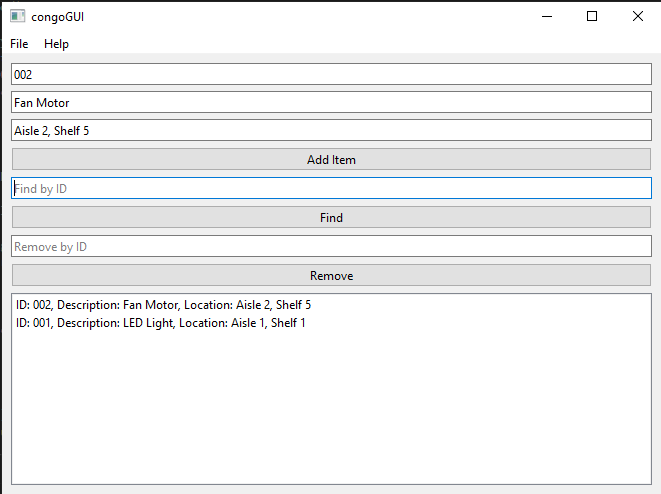

# CIS17B Assignment6
> Jericho Tolentino

I used Qt Creator to make the application but used code-based UI creation. To run the program you can clone this repository and open the folder you just cloned in Qt Creator and click the run button.

After running the programa the window should pop up and it will allow you to add items, find items by id, and remove items by id. It will also shows an error dialog for any exceptions raised and shows the list at the bottom of the application. 
